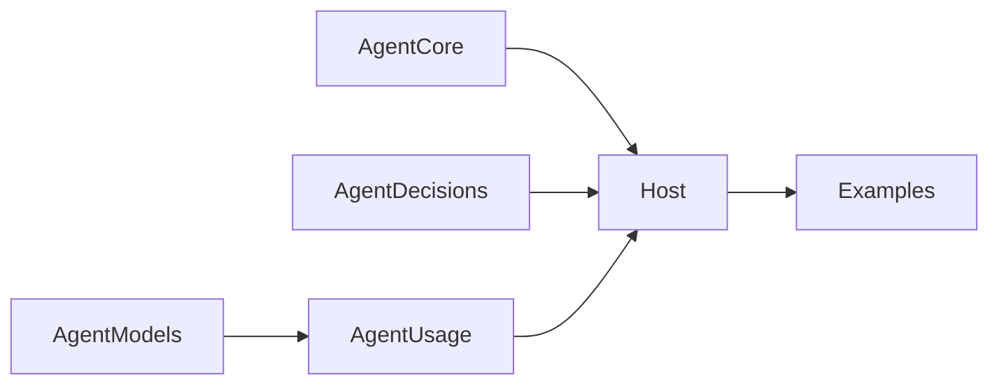

# Usage Accounting

Status: Approved

last-verified: 2026-09-20

## Scope

`AgentUsage` is an optional SwiftPM product that depends only on `AgentModels`.
It summarizes token counts visible through public model or decision responses.
It does not observe HTTP transport attempts, hidden route candidates, current
context size, prices, invoices, Evidence, Receipts, mutation state, or Journal
settlement.

AgentCore does not depend on AgentUsage. Hosts map their existing single event
consumer into usage observations; the accounting component never opens a
second `AgentRun.events` iterator and never changes execution outcomes.

## Public Boundary

- `UsageRecordIdentity` binds source, Session, Run, invocation, provider/model,
  and optional provider response ID. The response ID alone is never a global
  deduplication key. The model is also identity-bearing and remains stable for
  one invocation; event integrations use the started response's
  `ResponseInfo.model` for every later observation.
- Sources are explicitly classified as model responses or decisions. Unknown
  decoded source values are rejected until a Host wires their accounting path.
- `UsageObservation` is one cumulative snapshot or final confirmation for one
  identity.
- `UsageLedger` accepts observations idempotently and reports response, Run,
  Session, provider/model, or current-window summaries.
- `UsageFieldSummary` exposes reported subtotal, reported count, missing count,
  and field-level completeness. Missing is not zero.
- `UsageTokenSummary` groups those fields for all observed, finalized-only, or
  provisional-only responses so in-progress usage is never presented as a
  finalized total.
- `UsageDiagnostic` reports invalid values, regressions, finalized conflicts,
  and checked-arithmetic overflow without replacing the last valid record.

`inputTokens + outputTokens` is exposed as an exact total only when both fields
are complete over the same observed records. Cache counts are input subsets and
reasoning counts are output subsets, so they are never added again.

## Lifetime

The first release is in-memory and bounded by an explicit Host-owned window.
`removeAll()` clears that window. Reloading conversation history or a Journal
does not reconstruct prior usage and must not be described as lifetime Session
accounting. Codable export remains Host-owned data transfer, not a crash-safe
usage database.
