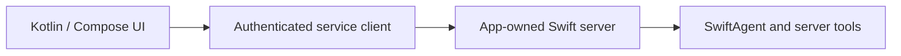
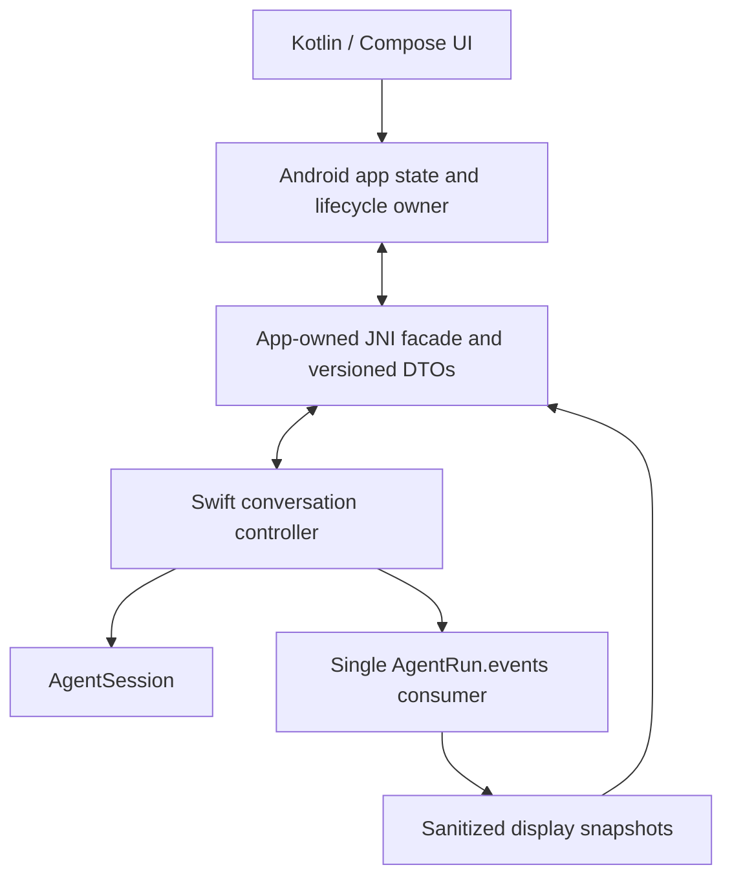

# Android clients and native SwiftAgent embedding

last-verified: 2026-09-19

Status: **two integration routes, not a claim of Android-native qualification**.
No Android bridge, Gradle target, APK/AAR or device test is added by this
document. Use the [RC.2 release checklist](../releases/1.0.0-rc.2-preparation-checklist.md)
for the candidate-specific support boundary.

## 1. Choose where the Agent runs

| Route | Where SwiftAgent runs | What the Android app needs | Qualification boundary |
| --- | --- | --- | --- |
| Remote service | A separately deployed server | Its authenticated HTTP/SSE/WebSocket client and app UI | Client/server integration; not native SwiftAgent support |
| Native embedding | Inside the Android process | Matched Swift/Android toolchain, native libraries and a tested Kotlin/Java bridge | Per-module builds, packaging and device/runtime evidence are still required |

Choose explicitly. Server-side credentials, central execution and deployment may
favor the first route. Reusing Swift logic in a local process may motivate the
second. Neither route makes a cloud model operate offline. A local Agent still
requires network access for a cloud Provider. This guide adds no on-device
Android model provider or Apple Foundation Models/PCC support on Android.

## 2. Remote-service route



Follow [the server guide](swift-agent-server.md). The Android app does not need
a Swift runtime or JNI for this route. It speaks an app-owned versioned protocol,
not `ModelEvent`, a raw vendor SSE stream or opaque continuation. Store app-side
view state separately from server canonical conversation.

Define authenticated conversation lookup, request identity, explicit Stop,
connection loss, app restart and status/reconnection. Starting collection again
must not issue another mutation. Cancelling a UI subscription is distinct from
an authorized server cancellation request; reflect the actual terminal outcome.

Server tools cannot inherently operate a phone's player, microphone or files.
A remote-device operation requires an explicit authenticated, capability-limited
protocol and local user authorization. A model-provided callback URL is not that
protocol. Do not silently add a second unrestricted executor in the Android app.

## 3. Native embedding: upstream setup first

The official [Swift SDK for Android getting-started guide](https://www.swift.org/documentation/articles/swift-sdk-for-android-getting-started.html)
separates the host compiler, Android Swift SDK and Android NDK. Its current
Swift 6.4 setup uses a matching open-source toolchain and SDK with NDK 30; Xcode's
installed `swift` should not be assumed to match a downloaded cross SDK. The
[Swift 6.4 release notes](https://www.swift.org/blog/swift-6.4-released/)
state that SwiftPM's Swift Build supports Android without the earlier post-install
script. Recheck these upstream instructions when changing versions.

Record exact host/toolchain, SDK artifact and checksum, NDK, ABI/API level,
Gradle/Android plugin, JDK, interop revision and test device. Do not turn the
upstream Hello World's target triple into SwiftAgent's minimum supported Android
version. Avoid mixed `latest` toolchains, copied older post-install scripts and
assumed ABI support.

Complete the upstream Hello World on a device/emulator before diagnosing this
package. An upstream compiler demonstration is **not** SwiftAgent qualification.
Then use [swift-android-examples](https://github.com/swiftlang/swift-android-examples),
particularly its `hello-swift-java` Kotlin/Compose frontend calling a Swift library,
as a packaging/interop reference. Its weather example also demonstrates selected
async and callback interop; this does not establish automatic bridging of all
SwiftAgent types.

Read [swift-java](https://github.com/swiftlang/swift-java) at the selected revision.
Its JNI mode is the Android route; desktop Java FFM mode is not a drop-in Android
replacement. Follow that revision's tooling and JDK requirements rather than
assuming every public Swift feature has a generated Java equivalent.

## 4. Qualify modules in a scratch consumer

Do not change SwiftAgent's published support matrix merely because the upstream
language supports Android. Begin with `AgentModels`, then `AgentTools` and
`AgentCore`, followed by the cloud provider products the app needs. Qualify
`AgentDecisions`/`AgentJevProvider` separately when needed. Keep
`AgentAppleProvider` out of the dependency graph; evaluate WorkspaceAgent and
its filesystem/Crypto behavior separately rather than importing all products.
See [Package.swift](../../Package.swift) and [Linux CI](../../Scripts/ci-linux.sh).
Linux target-build evidence is useful prior work, not Android evidence.

The following is an **unexecuted diagnostic command template**, to use in an
isolated SDK checkout only after upstream setup. The operator must choose the
installed SDK ID and the exact triple for the device; no values are invented:

```sh
swift --version
swift sdk list
: "${SWIFT_ANDROID_SDK_ID:?Set the installed Android Swift SDK identifier}"
: "${SWIFT_ANDROID_TRIPLE:?Set the verified Android target triple}"
swift build --swift-sdk "$SWIFT_ANDROID_SDK_ID" \
  --triple "$SWIFT_ANDROID_TRIPLE" --target AgentModels
```

That diagnostic neither builds an APK nor verifies the remaining modules.
Continue target-by-target, saving compiler/linker results and dependency
revisions. On failure, record the unsupported dependency, platform branch or
runtime symbol precisely. Propose a separately reviewed portability patch with
regression evidence; do not suppress errors, omit needed checks or add unchecked
conformance just to produce a library file.

Use a host bridge target with selected SwiftAgent products. Build each declared
ABI and package the actual required shared libraries/runtime dependencies using
the matched toolchain/example flow. Check a clean build and installed artifact,
not just a developer machine with cached libraries. In-app loading and target
behavior must be exercised after cross compilation.

## 5. Bridge ownership, not the entire SDK object graph



The facade/controller/DTOs above are app-owned, not public SwiftAgent products.
Design a narrow surface for starting a conversation/Run, receiving display
updates, requesting Stop, obtaining a terminal outcome and releasing observation.
These are responsibilities, **not** names of shipped bridge methods.

Do not expose arbitrary actor handles, `AsyncStream` iterators, provider objects,
Journal internals or continuation payloads to Kotlin. Check generator support
before choosing an exported shape. Use supported value DTOs or an explicitly
versioned serialized representation; Swift `Codable` alone does not define a
stable Java ABI or client protocol.

The Swift owner retains Session, startup task, Run, its one event consumer and
cleanup. Establish a generation before awaiting `session.run(...)`, then fence
callbacks with conversation/generation/Run identity. Account for Java/Kotlin
and Swift reference lifetimes; avoid retained callback cycles or invoking a
listener after its host object is released.

A Kotlin UI collector is not the Run owner. If collecting stops for navigation,
keep the Swift consumer alive and accumulate app state when the chosen policy
allows execution to continue. If the app instead stops execution on navigation,
explicitly request `run.cancel()` and retain cleanup. Do not assume Kotlin
coroutine cancellation propagates through a generated wrapper to the Run.

`run.wait()` and `run.waitForDrain()` have different meanings. Map both into the
host lifecycle; releasing a bridge handle cannot establish drain or remote
cancellation. Actor reentrancy and late callbacks remain relevant across JNI.
See [Sessions](swift-agent-sessions.md) and [UI streaming](swift-agent-ui-streaming.md).

## 6. UI delivery and Android lifecycle

Marshal display updates through Android's UI execution mechanism. Do not assume
Swift MainActor is Android's main Looper or that a bridge callback arrives on the
UI thread. Do not perform blocking waits on that thread. Explicitly define and
test which executor/queue invokes callbacks for the chosen bridge revision.

If the facade is wrapped in a Kotlin Flow/StateFlow, that is **app code**. A
conflated complete state snapshot can be appropriate after all original events
have been processed. Conflating raw deltas loses text; dropping tool receipts or
terminal outcomes loses facts. Use one Swift event consumer and per-view host
snapshots, not one SDK consumer per Compose collector. Keep errors, refusals,
incomplete results, logical completion and draining distinct.

Choose owners that survive the intended Activity/navigation lifecycle; rotation
or recomposition must not start a duplicate Run. Android lifecycle/background
mechanisms remain Android responsibilities. A native Swift Task is not a promise
of survival after process death or permission to bypass background restrictions.
Follow [Android lifecycle guidance](https://developer.android.com/topic/libraries/architecture/lifecycle)
and [background work guidance](https://developer.android.com/develop/background-work/background-tasks).

After process death, restore only committed state through the supported Journal
path and inspect uncertain mutations. Do not replay the last prompt or treat a
cancelled UI task as proof of no external effect. The owner may need to rediscover
Evidence. Restoring history does not reconnect an old SSE stream.

## 7. Network, storage and credential checks

Test HTTPS trust/DNS, streamed chunks, cancellation, errors and redirect behavior
in the Android process; desktop FoundationNetworking behavior is not sufficient
evidence. Include actual network permissions and target security configuration
in the app. Do not globally permit insecure HTTP to make a fixture work; isolate
local test transport from production endpoints.

Store journals in an app-authorized location and validate locks, append/durability,
reopen, corruption handling and storage failure on the target device. Uninstall,
backup/restore and app identity changes require host retention/recovery policy.
Avoid exposing raw filesystem paths or SDK mutation operations to model-driven
bridge calls. UI tool cards still do not grant tool authorization.

Keep team service secrets out of APKs and logs. Backend credentials and a
user-provided-key model have different threat/consent/storage designs; neither is
solved by converting a key to a Swift string. The bridge must not forward secrets,
opaque continuation or arbitrary unsafe provider errors to the UI.

## 8. Acceptance gates before claiming native support

| Gate | Required evidence |
| --- | --- |
| Toolchain | Matched recorded versions; upstream sample runs on the target |
| Selected SDK modules | Actual per-ABI compile/link and complete dependency inventory |
| App packaging | Fresh Gradle build, installed artifact and successful native loading |
| Runtime/network | In-process fixture runs, multi-turn stream, tools, cancellation and terminal validation |
| Bridge/UI | Stop during startup, late callbacks, listener release, rotation, navigation and two conversations |
| Persistence | Target-device restart/storage-failure tests and no automatic uncertain-mutation replay |
| Service qualification | Explicit bounded live-provider evidence, or precise NOT RUN/BLOCKED labeling |

An accepted native claim must state ABI, Android/API/device range, package and
bridge revisions, modules and scenarios. No Android tests, native bridge or APK
were run or built for this documentation change. Do not describe server access
as native qualification or a successful native build as real-service validation.
Use the general [acceptance checklist](../ai/acceptance-checklist.md) alongside
these target-specific gates.

## Sources and coding-agent handoff

Upstream paths reviewed on 2026-09-19: the linked official SDK guide/release notes,
Swift Android examples and swift-java. They establish available tooling and
interop paths. The SwiftAgent bridge and acceptance design above is a **host
recommendation**, not an upstream guarantee of library compatibility.

An Android integration brief must choose remote or native first. For remote,
implement the authorized client/server contract without adding Swift to the APK.
For native, record the toolchain, run the upstream sample, qualify a small module
set, then implement a narrow owned bridge and its tests. Use actual documented
APIs, keep portable Core unchanged unless a separately demonstrated bug requires
it, and report limits before expanding the support matrix.
