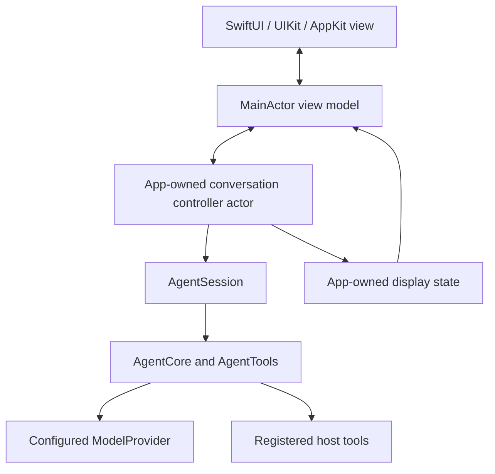

# Apple app integration: isolation, ownership and lifetime

last-verified: 2026-09-19

Scope: SwiftUI, UIKit or AppKit hosts using the public Agent/Session/Run API.
Read [the integration entry](../ai/start-here.md) for the checked SDK revision.
This is a host implementation guide, not an implemented UI product or a claim of
UI/device qualification. Companion: [UI streaming](swift-agent-ui-streaming.md).

## Separate display ownership from execution ownership

A recommended host structure is:



The controller and display state are app code. SwiftAgent does not export them.
One application-level controller can manage multiple conversation owners; it
must still preserve per-session and per-run identity.

| Owner | Responsibility |
| --- | --- |
| View | Present state and send user intents; no SSE parsing or execution decisions |
| MainActor view model | Light display changes, navigation and input state |
| Conversation controller | Retain Session/Run, start and stop ownership, single event consumption, drain coordination |
| Display projection | Accumulate complete display state and publish snapshots; never become canonical runtime history |
| Host service/tool | Own platform APIs, domain validation and real external effects |

`Agent` and `AgentRun` are Sendable values. `AgentSession`, Journal and Evidence
state use actor isolation. Core does not require MainActor; see
[the concurrency guide](swift-agent-concurrency.md). Do not add UI isolation to
portable SDK modules to make an app-side isolation error disappear.

## Async is not a background-thread promise

A task created in a MainActor context can inherit that isolation. An async wait
can suspend without blocking UI, but synchronous work inside that context still
occupies it. Constructing a large registry, loading a journal, parsing or
formatting large data, and repeatedly rendering a long transcript deserve
explicit placement away from the display actor.

Use actor boundaries and owned tasks, not a dedicated-thread assumption. An
ordinary actor serializes access to its own state; it is not a dedicated thread
or a substitute for reviewing blocking I/O. Do not use `Task.detached` as a
blanket wrapper: ownership, cancellation and Sendable values still need a design.
Use explicit executor choices only where supported by the actual toolchain and
needed for measured work.

Compile the consuming target with its real Swift version, language mode, default
actor isolation and upcoming-feature settings. In particular, nonisolated async
execution depends on isolation semantics and enabled features; do not assert that
every async function switches off the caller's actor. The relevant language
background is [Swift SE-0461](https://github.com/swiftlang/swift-evolution/blob/main/proposals/0461-async-function-isolation.md).

For a host tool that accesses a UI-isolated service, cross to a small MainActor
method explicitly. Keep network work, decoding and other expensive processing
out of that method. Do not capture non-Sendable UI objects in provider closures
and then hide the problem with an unchecked conformance.

## Model two dimensions of state

Keep the logical outcome and resource availability separate. A Run can already
have a completed, refused, incomplete, failed or cancelled outcome while its
physical work is still draining.

Suggested app states are `idle`, `starting`, `running`, `stopRequested` and
`draining`, plus a separately stored terminal outcome. These are app states, not
new SDK enum cases. Do not present `stopRequested` as proof of cancellation,
rollback or a free retry.

Reserve the start operation **before** awaiting `session.run(...)`. A Run ID is
not available during that await, so create an app-owned generation token first.
Use `(conversationID, generation, runID when available)` to fence all callbacks.
Actor methods are reentrant across awaits; a single actor alone does not prevent
an earlier operation's completion from overwriting newer UI state.

## Start and Stop protocol

The following is host lifecycle pseudocode, not a callable SDK helper:

```text
On Send:
  reject or explicitly queue according to the app's policy
  reserve a generation and set starting before the first await
  retain the startup task and the Session
  await session.run(input)
  associate the returned Run with the reserved generation
  if Stop/closure superseded this start, cancel this returned Run
  otherwise install exactly one owned consumer for run.events
  retain a completion/drain owner independent of a disappearing view

On Stop:
  record stopRequested for the current generation immediately
  if startup is pending, request cancellation and retain the pending-start fence
  if a Run exists, await run.cancel()
  keep processing terminal events while observation remains connected
  await logical completion, preserving the real result or error
  await run.waitForDrain() from the retained cleanup owner
  release only that generation's handles; then allow replacement
```

If startup throws before returning a Run, restore the reserved generation's state
without cancelling an unrelated Run. If a late Run handle arrives after Stop,
cancel and drain that handle; do not attach it to the new conversation. If a
blocked startup does not terminate promptly, surface that state rather than
pretending ownership has been released.

`run.cancel()` requests cancellation; it does not guarantee that cancellation
wins against a completion already being committed. Show the actual terminal
outcome. In a failure path, still arrange drain; code placed only after a
throwing `run.wait()` is insufficient cleanup.

A cancelled view task is not a reliable place to finish cancellation-sensitive
waits. Retain an app-owned cleanup task with a clear lifetime; do not start an
untracked fire-and-forget cleanup or block a UI thread with a semaphore. Cancelling
one drain waiter must not be interpreted as drain completion.

The Session rejects overlapping active runs. Reusing the same Session may await
its existing drain, but that does not provide a general UI request queue or an
automatic replace-current command. A replacement Session with the same identity
must respect the same ownership boundary. See [Sessions and Runs](swift-agent-sessions.md).

## Navigation and multiple windows

Choose and document one policy per conversation:

| Policy | When the view disappears | When the view returns |
| --- | --- | --- |
| View-owned execution | Explicitly request Run cancellation; retain a cleanup owner through terminal/drain | Start only when ownership permits |
| App-owned execution | Detach display only; controller continues consuming the Run | Read the controller's retained display snapshot |

Do not accidentally cancel an app-owned conversation because one window closed.
Do not start a second consumer of `run.events` in another window. Broadcast
app-owned snapshots instead. A disconnected SDK event observer cannot request
replay of missed events; journal checkpoints restore canonical conversation, not
the live event outlet.

## System backgrounding and restart

Leaving a page and entering the iOS background are different lifecycle events.
A Swift Task does not grant indefinite execution after suspension. Use only
appropriate platform background mechanisms, handle their expiration, and do not
promise to keep an arbitrary SSE connection alive indefinitely. See Apple's
[background execution guidance](https://developer.apple.com/documentation/uikit/extending-your-app-s-background-execution-time).

Process death requires a restore path: retain the intended Session identity and
journal location, recreate current configuration, inspect pending mutations, and
reconcile through a trusted host procedure. Do not automatically resubmit the
last prompt or call `abortMutation()` merely to clear the UI. Journal recovery
does not recover in-memory Evidence or resume a network connection.

`waitForDrain()` covers the SDK's run-resource lifecycle and any participating
provider drain hook. It is not a vendor acknowledgment of remote cancellation,
a billing refund, or a guarantee that a custom provider has implemented an
optional hook. Keep remote job status separate.

## Display and security boundary

A model proposal is not a UI permission grant. If a tool needs confirmation,
its host authorization path must resolve the trusted user decision and handle
cancellation, expiration and conversation identity. Do not return `.allowed`
because a tool card was displayed.

A Stop button must not call journal abort automatically. A retry of the same
logical mutation keeps its original non-empty operation ID and still passes
current Evidence/authorization checks. Another intentionally requested effect
has a different identity. Never generate a fresh identity just because an HTTP
request or UI task failed.

## Acceptance for an executable Apple example

The example implementation must verify rapid Send/Stop while startup is awaiting,
Stop followed by Send, page disappearance/return, two windows, two conversations,
late output after selection changes, and failure while draining. Use deterministic
barriers and observable exit signals for non-UI ownership tests.

Build on the claimed iOS/macOS targets. If using Observation APIs newer than
those targets, gate them or use an appropriate observable-object implementation;
do not raise the SDK's minimum OS for sample convenience. Manually run the UI and
check responsiveness, incremental output, terminal labels and navigation. Record
which devices/simulators and live/fixture modes actually ran. This guide itself
is not evidence that those acceptance checks passed.
