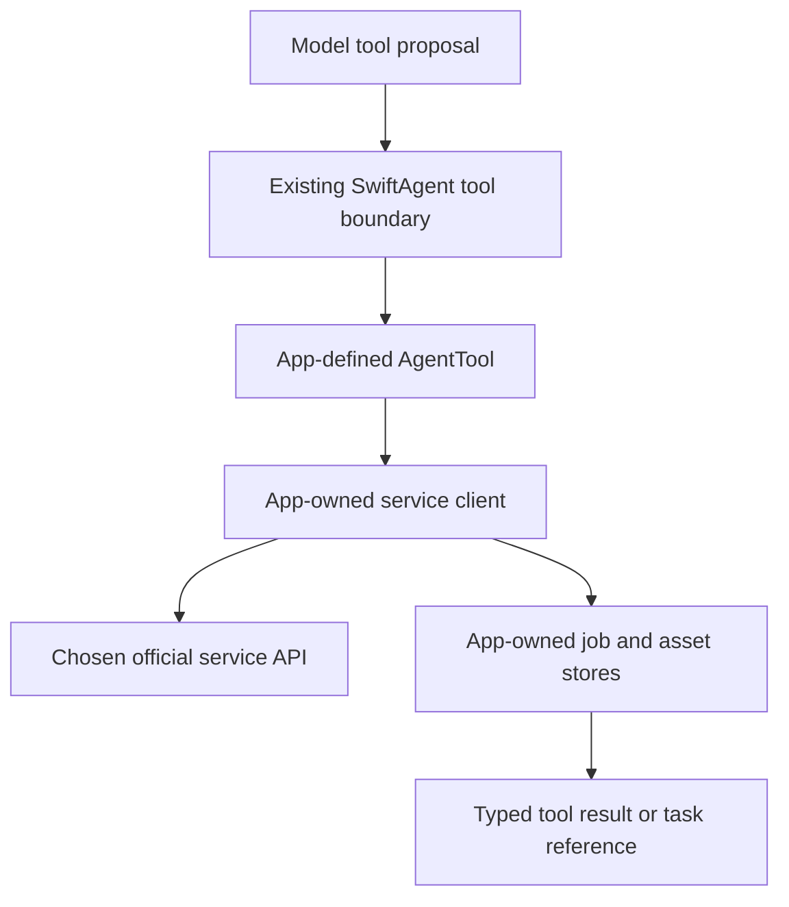

# Extending a host with speech, image, video or music services

last-verified: 2026-09-19

Status: **host architecture guidance only**. This document adds no multimedia
AI implementation, provider product, media content case or background job API to
SwiftAgent. All service-client, job-store and asset-reference names below are
app-owned design examples, not SDK symbols. See [the checked baseline](../ai/start-here.md).

## Choose by behavior, not by the AI label

A conversational provider supplies one normalized model turn. A Decision provider
supplies typed advice. A service that transcribes audio, synthesizes speech,
creates an image or submits a video job is generally an app capability that can
be exposed through a host-defined `AgentTool`.

Do not make every service conform to `ModelProvider`. Keep media dependencies,
credentials, platform frameworks and domain policy out of AgentCore. Multiple
services can share the app's settings, budget and asset UI without sharing one
untyped mega-provider protocol.

Select a concrete service and verify its official request, result, authentication,
timeout, cancellation and idempotency contract before writing an adapter. This
guide deliberately specifies no vendor endpoint, supported model or media limit.
Create an optional host module or extension package only when an actual app
requires it; do not change RC.2 runtime scope to implement these diagrams.

## A short operation

For a service returning a result within a controlled deadline, the host tool:

1. Declares typed Codable/Sendable input and output and supported schemas.
2. Validates app-owned input references and declares the resources it touches.
3. Obtains current authorization and required trusted Evidence through the
   existing runtime path.
4. Invokes a service client that never exposes credentials to the model.
5. Validates the service result and returns a typed result; if it is a mutation,
   returns a trusted Receipt matching the admitted operation and expectation.

The runtime, not the service client, remains responsible for tool admission and
durable settlement. A user-interface button may invoke an app operation without
an LLM, but must not use an unchecked direct executor to impersonate the
SwiftAgent mutation path. The app must still own its authorization, budget and
recovery policy.

Classify effects by what actually happens. Creating a remote job, saving an
asset or performing an operation with nontrivial irreversible consequences
must not be described as read-only merely because it returns generated content.
An inference request may still incur charges even when the host tool is
otherwise an observation; enforce spend policy separately rather than treating
`readOnly` as free.

## A long operation: separate submission and completion

Use a host-owned persisted job record rather than keeping an Agent Run alive by
repeatedly extending its timeout. Suggested fields are service/account namespace,
logical operation identity, vendor job ID, request fingerprint, observed status,
timestamps and asset references. These are not changes to the SDK Journal schema.

Separate the facts:

| Operation | What success establishes |
| --- | --- |
| Submit generation | The service accepted this particular job |
| Check status | A validated observation of that job at a particular time |
| Obtain and save output | Expected output was retrieved, validated and stored |
| Request remote cancellation | Only the cancellation behavior actually confirmed by the service |

A submission Receipt can settle **submission**, not claim that a video or song
has been produced. Do not create a succeeded generation Receipt from an HTTP
202 or from a model saying the job is complete. Define resource identity and
receipt expectation before executor entry using the supported contract; do not
invent a resource target after a side effect to force validation to pass. If a
service cannot supply evidence sufficient for the declared operation, redesign
the boundary rather than forge a Receipt.

After submission, host job infrastructure polls or processes authenticated
webhooks. It performs status observation, not another model/tool orchestration
loop. When the result is ready, update the app's asset state and, if needed,
start a new identified Agent Run for explanation or follow-up work.

## Timeout, cancellation and uncertain submission

A lost response can occur after the server accepted the job. Persist the logical
identity and use a vendor idempotency mechanism when available. On timeout,
query or reconcile the existing operation before another submission. A local
Journal cannot provide exactly-once execution for an arbitrary external API
that offers no matching idempotency/recovery mechanism.

A Stop action may mean stop observing, cancel the local request, or request
remote job cancellation. Expose those meanings accurately. Neither cancelling
a Swift Task nor draining an Agent Run proves a remote job stopped or a charge
was reversed. When the effect remains uncertain, retain that state.

Use `abortMutation()` only after trusted confirmation of **no external effect**
for the admitted operation. A user pressing Cancel is not such confirmation.
Do not clear pending state to allow a new request through.

## Keep media bytes outside conversation and journal frames

Return small app-owned asset descriptors: asset ID, job ID, MIME type, validated
byte size, duration/dimensions as applicable, content hash and an access reference.
The asset store owns bytes and retention. Do not place large Base64 payloads or
signed download URLs containing secrets into model conversation history.

Validate download origin, redirect policy, size and content before storing.
Treat model-supplied URLs and paths as untrusted; resolve approved host asset
identities instead of allowing arbitrary fetches or writes. Enforce output paths,
expiry, quota and user access. Redact credentials and signed query parameters in
logs.

The baseline `ModelContent` contains text, reasoning, JSON and provider
continuation, not a general media attachment API. Producing an image does not
make the conversational model capable of seeing it. A future multimodal input
integration needs an explicit upload/reference and model-input design; do not
hide bytes in JSON or continuation to bypass that absence. See
[ModelMessage.swift](../../Sources/AgentModels/ModelMessage.swift).

## Speech and real-time sessions

A bounded first integration can use transcription, a confirmed user text turn,
the existing Agent Run, then speech synthesis of the accepted response. Do not
trigger an irreversible tool from a changing interim transcript. Do not speak
reasoning or opaque continuation as if it were the user-facing answer.

Real-time bidirectional audio adds input/output buffering, interruption, turn
boundaries and potentially vendor-native tool proposals. It requires a separate
host design. It must not introduce a second executor authority or bypass
SwiftAgent because the vendor connection also supports tool calling. This guide
does not promise an existing real-time voice bridge.

## Documentation-only completion checklist

An app-specific extension plan should name the service contract, short/job
lifecycle, effect policy, credentials, user consent, spend limits, operation
identity, reconciliation, asset storage, UI ownership and tests. Mark missing
vendor evidence explicitly. Use synthetic fixtures before opt-in real calls.

No multimedia provider or general-purpose media framework is required to accept
this document. Existing [tools](swift-agent-tools.md),
[scheduling](swift-agent-scheduler.md), [receipts](swift-agent-receipts.md) and
[journal](swift-agent-journal.md) contracts remain authoritative.
