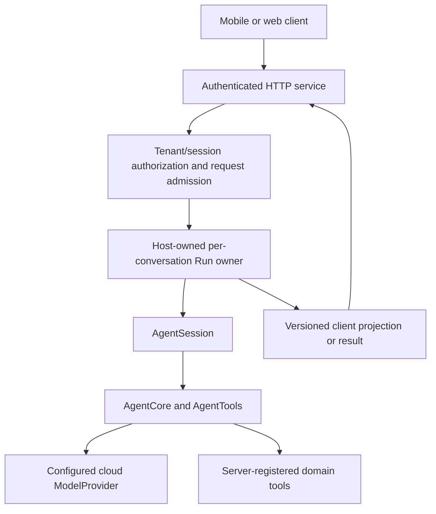

# SwiftAgent in a Linux server application

last-verified: 2026-09-19

Status: **host integration guidance, not a shipped HTTP server or deployment
qualification**. The SDK contract baseline is
`c5f08c7520c989cf01234e19c1fd011b486ca76f`; the accompanying integration-docs
revision is `4d3f3b784a95ec4528782d1245862e01a9024c6a`. Read the installed
revision's [integration entry](../../INTEGRATION.md) before using its API.

## What is supported, and what this guide adds

[Swift on Server](https://www.swift.org/documentation/server/) describes the
server ecosystem. Its [server guides](https://www.swift.org/documentation/server/guides/)
cover Linux building, testing, deployment and diagnostics. Those are upstream
Swift resources, not evidence that a particular SwiftAgent service has shipped.

The repository's [Linux CI script](../../Scripts/ci-linux.sh) separately builds
`AgentModels`, `AgentTools`, `AgentCore`, `AgentProviders`, `AgentDecisions` and
`AgentJevProvider`, then runs package and ExternalClient tests. It also guards
against compiling Apple/Workspace targets as dependencies of those target builds.
See [testing](../testing.md) for the recorded toolchain and evidence.

A Linux package check is not a load test, multi-tenant security review, container
restore test or production deployment. This contribution runs none of those
checks. No server executable, HTTP DTO, database adapter or framework dependency
is added. Everything named `ServerRunOwner`, `ClientEvent` or a service endpoint
below is **host-owned design**, not an exported SwiftAgent API.

## 1. Build the host around the runtime



Select a web framework in the server app, not in AgentCore. Start a normal app
using the maintained [Vapor Hello World guide](https://docs.vapor.codes/getting-started/hello-world/)
or [Hummingbird documentation](https://github.com/hummingbird-project/hummingbird).
They are examples of host frameworks, not mandatory SDK dependencies. Pin the
chosen framework and SwiftAgent versions before adapting the request handler.

Add the products required by that handler: typically `AgentCore`, `AgentModels`,
`AgentTools` and a cloud provider product; Decision/Jev are optional separate
products. Apple on-device/PCC is not a Linux cloud-model replacement. Add
WorkspaceAgent only if the service actually needs that Reference Host and its
filesystem policy. Inspect [Package.swift](../../Package.swift) rather than
copying every product into the server.

On an isolated Linux checkout with the repository's required toolchain:

```sh
# SwiftAgent repository root; ci-linux.sh cleans its own build output.
swift --version
bash Scripts/ci-linux.sh
```

Use the existing install/require-toolchain scripts and official installation
instructions when preparing the machine. Do not mix arbitrary `latest` images
with a pinned Swift 6.4 validation requirement. In the **host server project**,
run its own build, tests and release build as well; the SDK script does not build
the HTTP handlers. No framework-specific route code is presented as a tested
copy-and-run sample here.

## 2. Own users, sessions and effects explicitly

Authenticate before creating or looking up a conversation. Resolve a client-facing
conversation identifier through an authorized `(tenant, user, conversation)`
mapping. Do not trust an arbitrary Session UUID, journal path, model endpoint or
operation ID supplied by a request as authority over another user's resources.

A shared Agent configuration may be useful, but **do not share one global
AgentSession across clients**. Keep a retained owner for each active conversation,
with a registry that serializes acquisition before awaiting Run startup. The
Session allows one active Run; it is not a server queue. Choose an explicit
reject, enqueue or cancel-and-replace policy for simultaneous requests. For
replacement, retain the old owner through cancellation and drain. Protect late
callbacks with a host generation token, including startup before a Run ID exists.
See [Sessions and Runs](swift-agent-sessions.md).

Map logical operation IDs into the authenticated host domain and keep them stable
for retries of the same intended effect. Journal deduplication can cross Runs and
Sessions; raw unscoped client IDs in a shared journal can collide across tenants.
Do not assign a new ID merely because HTTP delivery timed out. Share a scheduler
across sessions touching the same real resources, including intentionally shared
resources, without using that scheduler as a substitute for authorization.

Server tools operate on **server-accessible resources**. Controlling a phone's
player, microphone or private files requires a separate authenticated device
channel and device-side authorization. A server tool proposal is not device
permission. This guide does not add a remote-executor protocol.

## 3. Choose request-owned or service-owned work

| Host policy | On HTTP disconnect | Source of later status |
| --- | --- | --- |
| Request-owned Run | Explicitly request Run cancellation; retain cleanup until logical termination and drain | Retained terminal/recovery state as defined by the service |
| Service-owned Run | Detach the connection only; a retained owner keeps consuming events | An authorized host status/snapshot or persisted event API |

Neither policy is implicit in `AgentRun.events`. Cancelling an event observer
disconnects observation, not execution. `run.cancel()` requests cancellation;
`wait()` supplies a logical result/error; `waitForDrain()` waits for the SDK's
resource lifecycle and participating provider drain hooks. It does not prove a
vendor cancelled computation or refunded a request. A cancelled HTTP handler
must not be the only owner of cleanup. Do not block an event-loop thread with a
semaphore, synchronous future wait or a long filesystem operation.

Design the lifecycle before wiring it to framework hooks. This is pseudocode:

```text
authenticate and authorize the conversation
reserve per-conversation generation before the first await
start session.run with the trusted configuration and logical operation identity
retain returned Run and one event consumer
if startup was superseded: explicitly cancel and clean up that Run
project events to the response or a host-owned job/event store
on disconnect: apply the declared request-owned/service-owned policy
on any terminal path: preserve result/error, then arrange drain
release only the matching generation; do not lose uncertain mutation records
```

Per-tenant concurrency, token/output limits, timeouts, tool-call budgets and spend
limits belong at admission. Return a busy or queued state rather than launching
unlimited Runs. Do not automatically retry a failed Run with external effects.

## 4. Expose a client protocol, not the vendor stream

There are two distinct streaming boundaries:

```text
vendor HTTP/SSE -> provider validation -> ModelEvent -> AgentCore
-> AgentRun.events -> host ClientEvent projection -> HTTP SSE/WebSocket -> UI
```

The service consumes `AgentRun.events` once. Define a versioned allowlisted DTO
for clients rather than serializing runtime objects or proxying raw provider SSE.
`AgentEvent` is not a frozen network schema. Omit opaque continuation, credentials,
internal paths and unnecessary tool arguments; map typed failures to safe codes.

An application protocol can carry protocol version, conversation/Run identity,
turn number, host event sequence, allowed text/progress payload and logical
terminal outcome. Those are proposed **host fields**, not SDK event members.
Do not reuse vendor sequence numbers as durable client replay offsets.

For SSE, implement UTF-8 framing and JSON encoding in the host transport. Test
flush behavior, proxy buffering, idle timeouts and heartbeat policy using the
actual deployment. A heartbeat is connection liveness, not Agent progress.
Handle authenticated streaming requests using a client/transport that supports
the chosen authentication method; never put reusable secrets in stream URLs.
Do not assume every client streaming API supports the same methods or headers.

A model response completing is not the whole Run completing. Mark text deltas
provisional and handle Run outcomes including refusal, incomplete, failure and
cancellation. Do not append final text a second time. See
[UI streaming](swift-agent-ui-streaming.md) for event meanings.
`ModelProviderRoute` intentionally buffers a candidate until validation and does
not advertise real-time streaming; do not remove that boundary for faster UI.

If reconnection is supported, the **host** must implement retention, ordering,
authorized resume offsets and gap/snapshot behavior. Reconnecting must not start
another logical Run. Journal checkpoints are canonical recovery, not an HTTP
replay log. Bound subscriber buffers: snapshots may coalesce after every raw
event is processed, but dropping raw deltas/receipts/terminal events loses facts.
For slow subscribers, specify disconnect/resume or cancel behavior rather than
an unlimited queue. Removing one subscriber must not cancel unrelated viewers.

## 5. Persistence, shutdown and multiple instances

Keep durable journals and host records on storage with verified permissions,
retention and durability semantics; an ephemeral container layer is not a recovery
plan. Exercise actual filesystem and lock behavior in the target deployment.
Avoid concurrent independent writers to a shared journal unless the supported
ownership/locking contract has been verified there. Backups must be consistent,
not casual copies of an active append stream. Protect logs and restored history
as user data. See [Journal](swift-agent-journal.md).

At shutdown, stop admission, choose finish/cancel policy for active Runs, and give
retained owners a bounded opportunity to finish and drain. If process termination
wins, preserve pending effects for trusted reconciliation. Do not mark them
aborted or remove durable intent merely to make shutdown look clean. On restart,
restore canonical conversation with current instructions, rediscover Evidence
when required, and reconcile uncertain mutations. Do not automatically resubmit
the last UI prompt. See [consumer recovery recipes](../ai/consumer-recipes.md).

Actors, scheduler coordination and Session identity registries are not a
multi-server lease or distributed transaction system. Horizontal scaling needs a
host design for exclusive conversation ownership, generation fencing, shared
resource coordination, persistence and effect idempotency. Sticky routing alone
does not solve failover or split ownership. Do not present the SDK file journal
as a distributed database, or replace it with a guessed public persistence API.

Keep model keys in server configuration/secret management, selected by trusted
policy. Select runtime/container dependencies from the real build artifacts and
framework guidance; test release-mode TLS, DNS and dynamic-library loading.
Do not imply any Dockerfile or orchestration manifest was qualified by this doc.

## 6. Acceptance and coding-agent handoff

Before accepting a host implementation, record the exact SDK/host commits,
toolchain, OS/architecture, framework revision, storage and proxy configuration.
Test:

- Different users cannot read/cancel/steer each other's Runs or collide operation
  identities; duplicate requests follow the declared admission policy.
- Disconnect during startup, streaming and a tool does not lose ownership or
  fabricate rollback; replacement waits for the required drain boundary.
- One consumer drives multiple clients; slow clients and reconnects do not lose
  terminal facts, duplicate text or trigger a second tool execution.
- Real deployment restart and shutdown preserve pending mutation state and
  require trusted reconciliation. No fabricated Receipt enables recovery.
- Package, host, deployment and live-provider results are reported separately;
  missing keys and an unstarted hosted runner are not passing tests.

An integration-agent brief should specify the chosen framework and lifecycle
policy, require public API only, and prohibit changes to portable Core to fit an
HTTP handler. Start with synthetic no-effect tools. Build and exercise the real
server before publishing deployment support; no such executable was added here.

## Upstream sources and scope

Reviewed on 2026-09-19: [Swift on Server](https://www.swift.org/documentation/server/),
[server guides](https://www.swift.org/documentation/server/guides/),
[Vapor Hello World](https://docs.vapor.codes/getting-started/hello-world/) and
[Hummingbird](https://github.com/hummingbird-project/hummingbird).
These establish framework/setup paths. Session behavior is grounded in the
linked SDK contracts; tenant, HTTP and deployment designs above are host
recommendations. Documentation review is not fresh Linux execution, server
load/security qualification, or permission to claim release readiness.
