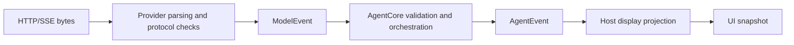

# Rendering Agent events in a UI

last-verified: 2026-09-20

Scope: consumers of `AgentRun.events`, not implementers of a vendor SSE decoder.
See [the integration baseline](../ai/start-here.md) and
[Apple UI ownership](swift-agent-apple-ui.md).

## Keep the transport behind the provider

For the HTTP Responses adapters, request streaming uses SSE. Structured answer
format and streaming are separate choices. The UI does not split `data:` lines,
sort vendor sequence numbers, handle `[DONE]`, reconnect a vendor request, or
execute a function found in a wire event. Those choices belong to the provider
and runtime contracts. See [OpenAIResponsesProvider.swift](../../Sources/AgentProviders/OpenAIResponsesProvider.swift).

Use `AgentRun.events` for an Agent app. A direct `ModelProvider.stream(request:)`
example is a lower-level one-turn client, not an alternative host tool loop.

## One consumer, multiple displays

`AgentRun.events` is a single-consumer `AsyncStream<AgentEvent>`. It is not a
broadcast or replay subscription. One retained controller consumes it; chat,
progress UI and diagnostics receive app-owned projections or explicitly
redacted copies. Starting separate loops over the same Run for each UI is not
supported.

Cancelling an event observer disconnects observation, not execution. Use
`run.cancel()` to request execution cancellation. A disconnected observer is not
guaranteed the terminal tail. `run.wait()` remains an independent way to retrieve
the logical outcome. See [AgentRun.swift](../../Sources/AgentCore/AgentRun.swift)
and [the event contract](swift-agent-events.md).

## Project by identity, not arrival into one string

Track conversation ID, host generation, Run ID, turn number, response ID when
available, and tool call ID. Fence publication against the currently displayed
generation. Parallel tools may complete in a different order from proposal order.
Keep distinct tool entries keyed by call ID rather than matching a tool name.

Each model turn gets its own display segment. Tool preambles, tool results and
later answers must not all become one undifferentiated text blob. Preserve the
arrival order of normalized content; do not sort text and reasoning into a new
canonical order. Hiding a reasoning segment is a display preference, not a reason
to rewrite Session history or provider continuation.

| SDK event | Display interpretation | Do not infer |
| --- | --- | --- |
| `runStarted` | Associate Run and Session identity | That a remote request or tool succeeded |
| `turnStarted` | Begin the numbered model-turn segment | That the previous turn was the final answer |
| `model(.responseStarted)` | Associate response identity | Durable assistant history |
| `model(.textDelta)` | Append provisional text to this turn | A final, validated answer |
| `model(.reasoningDelta)` | Optional separate provisional reasoning display | Authorization or a requirement to expose private state |
| Model tool-call events | Show a proposal and argument progress, if appropriate | Host executor entry or success |
| `toolStarted` | Show runtime tool-attempt progress | A resource lease, executor start, completed effect or a UI-issued permission |
| `toolReceiptValidated` | Record a runtime-accepted receipt and its effect | That any arbitrary model JSON is a receipt |
| `toolCompleted` | Show validated result; inspect `isError` | That every tool result means success |
| `toolFailed` | Show failed/uncertain attempt as appropriate | That an external effect was rolled back |
| `steeringApplied` | Mark that correction as applied to run context | That a later model request succeeded |
| `model(.responseCompleted)` | Confirm a single model response | Whole Run completion |
| `runFinished` | Show result outcome, typed failure or cancellation | Physical drain or reversal of past effects |

A `.result` terminal still has an outcome such as completed, refused or
incomplete. Do not render every `.result` as success. The event stream itself is
nonthrowing; typed Run failure is carried in its terminal event. Ending iteration
alone is not proof of success. `wait()` may throw the original error.

## Provisional output and finalization

Text and reasoning deltas are validated prefixes, not final canonical content.
AgentCore withholds normalized model completion until the clean stream and model
identity checks pass. If a later transport or protocol error invalidates that
response, mark its draft failed or incomplete; do not publish it as committed
assistant history.

Accumulate deltas once. When the normalized response completes, reconcile or
confirm the existing turn projection; do not append the entire response text a
second time. Do not replay `result.history` into a buffer that already contains
all its displayed turns. After restart, build a fresh projection from the
canonical history instead of mixing restored history with an old event offset.

A function proposal becomes an attempted operation only through the runtime.
A visible statement such as "I saved the file" does not establish mutation
success. Preserve validated receipts and actual tool outcomes even if a later
model turn fails.

For structured output, streaming text fragments may not form valid JSON. Display
a draft or a neutral progress indicator; publish a domain value only after the
supported complete-response validation path. Do not repair partial JSON and use
it to trigger actions. The current `ModelEvent` API does not provide a public
incremental typed-JSON patch channel.

Usage events are cumulative snapshots. A missing field is unreported, not zero;
do not sum repeated snapshots or double-count reasoning/cache subsets. Usage is
not necessarily the provider's complete billing invoice. See
[ModelMetadata.swift](../../Sources/AgentModels/ModelMetadata.swift).

## Decouple event consumption from drawing

Maintain full display state while continuously consuming events. Merge adjacent
text changes for presentation and publish snapshots at an app-chosen cadence;
flush the final state on terminal transitions. Do not run expensive Markdown
layout or synchronous logging once per delta on MainActor.

Raw deltas and lifecycle events are not replaceable. Never apply a newest-one
buffer to them: it can lose text, receipts and terminal events. A newest-one
policy may be appropriate for **complete, self-contained UI snapshots** after
all raw events have been processed. A snapshot must retain terminal outcome and
tool states, so a skipped intermediate render does not lose those facts.

Keep control/lifecycle processing independent of a slow view. Spawning one
unstructured UI task per event can grow work without bound and reorder display
updates. Use one ordered projection pipeline with generation checks.

The baseline Session uses the default AsyncStream buffer; Apple's
[AsyncStream reference](https://developer.apple.com/documentation/swift/asyncstream)
describes that default as unbounded. UI throttling is not end-to-end backpressure.
Test a deliberately slow or absent display consumer, bound app-owned snapshots
and retained display history, and define a policy for sustained overload without
silently dropping runtime events. Do not claim a hard memory cap supplied by this
guide or by a UI refresh timer.

## Direct streaming versus validated fallback

`ModelProviderRoute` buffers a candidate response until it validates and removes
`.streaming` from its descriptor. A network SSE connection beneath that route
does not imply real-time text delivery to the UI. See
[ModelProviderRoute.swift](../../Sources/AgentProviders/ModelProviderRoute.swift).

A direct streaming-capable provider can show real incremental text. A validated
route should show honest waiting/progress and then its validated turn. Do not
turn off validation or simulate typing to claim lower time-to-first-token.
Buffered/planning providers should remain usable with the same UI, without a
promise of token-by-token output.

The two routes are executable in
[Examples/AppleChatApp](../../Examples/AppleChatApp). **Streaming** uses the local
provider directly and appends normalized deltas. **Validated** wraps the same
provider in `ModelProviderRoute`; the descriptor does not claim `.streaming`, and
the UI labels the mode as “Published after route validation.” Both routes feed
the same `ConversationProjection`; there is no alternate loop or simulated
typing path.

## Privacy and acceptance

Never display or log provider-continuation payloads or credentials. Reasoning
visibility, prompt retention, tool arguments and diagnostics need an explicit
host privacy policy. Map typed failures to app-localized messages; do not use
arbitrary error descriptions as a public UI contract.

Acceptance should include a multi-turn tool loop, refusal, valid incomplete
output, protocol failure after visible deltas, recoverable tool error, Stop,
slow rendering, navigation, and a buffered route. Verify no duplicate final text,
no lost accumulated text, no stale-generation repaint and no false tool-success
label. `Examples/AppleChatApp` covers these protocol and lifecycle cases with 21
tests in four suites, including deterministic lifecycle gates. Fixture UI behavior was observed on macOS
27.0. The explicit live configuration uses the same projection and Controller;
its OpenAI-compatible two-request tool loop completed, but current automation
could not inspect the rendered window contents, so that run is not a new visual
acceptance claim. Run ownership is covered separately in the Apple UI guide.
